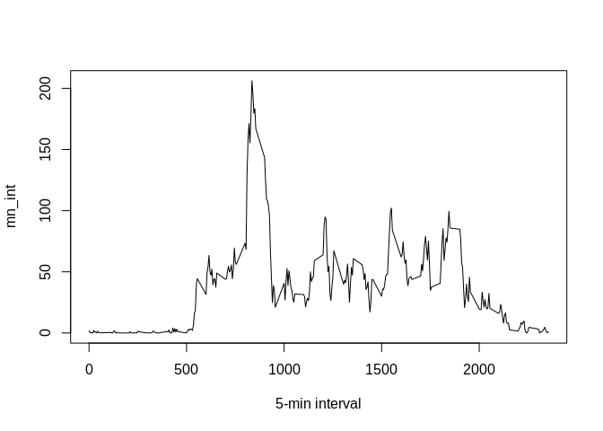

## Introduction

It is now possible to collect a large amount of data about personal
movement using activity monitoring devices such as a
[Fitbit](http://www.fitbit.com), [Nike
Fuelband](http://www.nike.com/us/en_us/c/nikeplus-fuelband), or
[Jawbone Up](https://jawbone.com/up). These type of devices are part of
the "quantified self" movement -- a group of enthusiasts who take
measurements about themselves regularly to improve their health, to
find patterns in their behavior, or because they are tech geeks. But
these data remain under-utilized both because the raw data are hard to
obtain and there is a lack of statistical methods and software for
processing and interpreting the data.

This assignment makes use of data from a personal activity monitoring
device. This device collects data at 5 minute intervals through out the
day. The data consists of two months of data from an anonymous
individual collected during the months of October and November, 2012
and include the number of steps taken in 5 minute intervals each day.

## Data

The data for this assignment can be downloaded from the course web
site:

* Dataset: [Activity monitoring data](https://d396qusza40orc.cloudfront.net/repdata%2Fdata%2Factivity.zip) [52K]

The variables included in this dataset are:

* **steps**: Number of steps taking in a 5-minute interval (missing
    values are coded as `NA`)

* **date**: The date on which the measurement was taken in YYYY-MM-DD
    format

* **interval**: Identifier for the 5-minute interval in which
    measurement was taken


The dataset is stored in a comma-separated-value (CSV) file and there
are a total of 17,568 observations in this
dataset.

## Solution

### 1. Loading and preprocessing the data
Download input file and extract it

```r
echo=TRUE
destfile <- "RR_CP1_data.zip"
# Checking if archieve already exists.
if (!file.exists(destfile)){
  fileURL <- "https://d396qusza40orc.cloudfront.net/repdata%2Fdata%2Factivity.zip"
  download.file(fileURL, destfile=destfile)
}  

# Checking if folder exists
if (file.exists(destfile) ) 
{ 
  unzip(destfile) 
} else
{
  print("Data file is missing")
}
activity <- read.csv("activity.csv", header = T, sep = ",")
str(activity)
```

```
## 'data.frame':	17568 obs. of  3 variables:
##  $ steps   : int  NA NA NA NA NA NA NA NA NA NA ...
##  $ date    : Factor w/ 61 levels "2012-10-01","2012-10-02",..: 1 1 1 1 1 1 1 1 1 1 ...
##  $ interval: int  0 5 10 15 20 25 30 35 40 45 ...
```

### 2. What is mean total number of steps taken per day?
Calculate the total number of steps taken per day

```r
echo=TRUE
steps_per_day<-tapply(activity$steps, activity$date, sum, na.rm=T)
steps_per_day
```

```
## 2012-10-01 2012-10-02 2012-10-03 2012-10-04 2012-10-05 2012-10-06 
##          0        126      11352      12116      13294      15420 
## 2012-10-07 2012-10-08 2012-10-09 2012-10-10 2012-10-11 2012-10-12 
##      11015          0      12811       9900      10304      17382 
## 2012-10-13 2012-10-14 2012-10-15 2012-10-16 2012-10-17 2012-10-18 
##      12426      15098      10139      15084      13452      10056 
## 2012-10-19 2012-10-20 2012-10-21 2012-10-22 2012-10-23 2012-10-24 
##      11829      10395       8821      13460       8918       8355 
## 2012-10-25 2012-10-26 2012-10-27 2012-10-28 2012-10-29 2012-10-30 
##       2492       6778      10119      11458       5018       9819 
## 2012-10-31 2012-11-01 2012-11-02 2012-11-03 2012-11-04 2012-11-05 
##      15414          0      10600      10571          0      10439 
## 2012-11-06 2012-11-07 2012-11-08 2012-11-09 2012-11-10 2012-11-11 
##       8334      12883       3219          0          0      12608 
## 2012-11-12 2012-11-13 2012-11-14 2012-11-15 2012-11-16 2012-11-17 
##      10765       7336          0         41       5441      14339 
## 2012-11-18 2012-11-19 2012-11-20 2012-11-21 2012-11-22 2012-11-23 
##      15110       8841       4472      12787      20427      21194 
## 2012-11-24 2012-11-25 2012-11-26 2012-11-27 2012-11-28 2012-11-29 
##      14478      11834      11162      13646      10183       7047 
## 2012-11-30 
##          0
```

Make a histogram of the total number of steps taken each day  
Calculate and report the mean and median of the total number of steps taken per day

```r
echo=TRUE
hist(steps_per_day, xlab="SUM of steps/day", breaks=20)
abline(v=mean(steps_per_day), col="blue")
abline(v=median(steps_per_day), col="yellow", lty=2)
legend(2000, 10, legend=c("Mean", "Median"), col=c("blue", "yellow"), lty=1:2, cex=0.8)
```

<!-- -->

```r
mean(steps_per_day)
```

```
## [1] 9354.23
```

```r
median(steps_per_day)
```

```
## [1] 10395
```

### 3. What is the average daily activity pattern?
Make a time series plot (type="l") of the 5-minute interval (x-axis) and the average number of steps taken, averaged across all days (y-axis)

```r
echo=TRUE
mn_int <- tapply(activity$steps, activity$interval, mean, na.rm=T)
plot(mn_int ~ unique(activity$interval), type="l", xlab = "5-min interval")
```

<!-- -->

Which 5-minute interval, on average across all the days in the dataset, contains the maximum number of steps?


```r
echo=TRUE
mn_int[which.max(mn_int)]
```

```
##      835 
## 206.1698
```


### 4. Imputing missing values

Calculate and report the total number of missing values in the dataset

```r
echo=TRUE
sum(is.na(activity))
```

```
## [1] 2304
```

Devise a strategy for filling in all of the missing values in the dataset.  
I believe that average values at different weekdays might be different from each other, therefore  
the algorithm I want to implement is as follows:  
- Create aggregate for weekdays by interval (wi)  
- Iterate on NAs and populate steps from wi by interval and weekday  

Create a new dataset that is equal to the original dataset but with the missing data filled in


```r
echo=TRUE
activity$weekday<-weekdays(as.Date(activity$date))
ag<-aggregate(steps ~ interval+weekday, data = activity, FUN = mean, na.omit=T)
impuned_activity<-activity
index_of_na <- which(is.na(impuned_activity))
for (i in index_of_na) {
  impuned_activity$steps[i] <- with(ag, steps[interval == impuned_activity$interval[i] & weekday==impuned_activity$weekday[i]])
}
```

Make a histogram of the total number of steps taken each day and Calculate and report the mean and median total number of steps taken per day.

```r
echo=TRUE
spd<-tapply(impuned_activity$steps, impuned_activity$date, sum, na.rm=T)
hist(spd, main="Steps taken per day", xlab="SUM of steps/day", breaks=20)
abline(v=mean(spd), col="blue")
abline(v=median(spd), col="yellow", lty=2)
legend(1, 10, legend=c("Mean", "Median"), col=c("blue", "yellow"), lty=1:2, cex=0.8)
```

<!-- -->

Comparison of the mean and median total number of steps taken per day

```r
echo=TRUE
#df<-data.frame(c(mean(spd), median(spd)),c(mean(steps_per_day), median(steps_per_day) ), row.names = c("Means", "Medians") )
df<-data.frame(c(mean(spd), median(spd), median(spd)-mean(spd)), c(mean(steps_per_day), median(steps_per_day), median(steps_per_day)-mean(steps_per_day) ), row.names = c("Means", "Medians", "Difference") )
colnames(df)<-c("Impuned", "Not impuned")
df
```

```
##               Impuned Not impuned
## Means      10821.2096     9354.23
## Medians    11015.0000    10395.00
## Difference   193.7904     1040.77
```

The values of mean and median are different after imputing missing data: They are higher and median is closer to the mean. 

### 5. Are there differences in activity patterns between weekdays and weekends?
Create a new factor variable in the dataset with two levels – “weekday” and “weekend”

```r
echo=TRUE
impuned_activity$weekdaytype<-c("weekday")
impuned_activity$weekdaytype[impuned_activity$weekday %in% c("Saturday", "Sunday")] <- c("weekend")
table(impuned_activity$weekdaytype == "weekend")
```

```
## 
## FALSE  TRUE 
## 12960  4608
```

```r
impuned_activity$weekdaytype<-as.factor(impuned_activity$weekdaytype)
```

A panel plot containing a time series plot

```r
library(ggplot2)
echo=TRUE
steps_per_weekday <- aggregate(steps ~ interval+weekdaytype, data = impuned_activity, FUN = mean)
ggplot(steps_per_weekday, aes(x = interval, y = steps)) +
    geom_line(col = "blue", size = 1) + 
     facet_wrap(~ weekdaytype, nrow=2, ncol=1) + 
     labs(x = "Interval", y = "Number of Steps") + geom_hline(yintercept=100, linetype="dashed", color = "red")+
     geom_hline(yintercept=50, linetype="dashed", color = "green")
```

<!-- -->

The patterns for weekdays and weekends are different. At weekday there is a peak around interval 835 and then for entire day the activity is mostly below average 50-100 steps.  
At weekend there is an average activity during entire day above 50-100 steps
